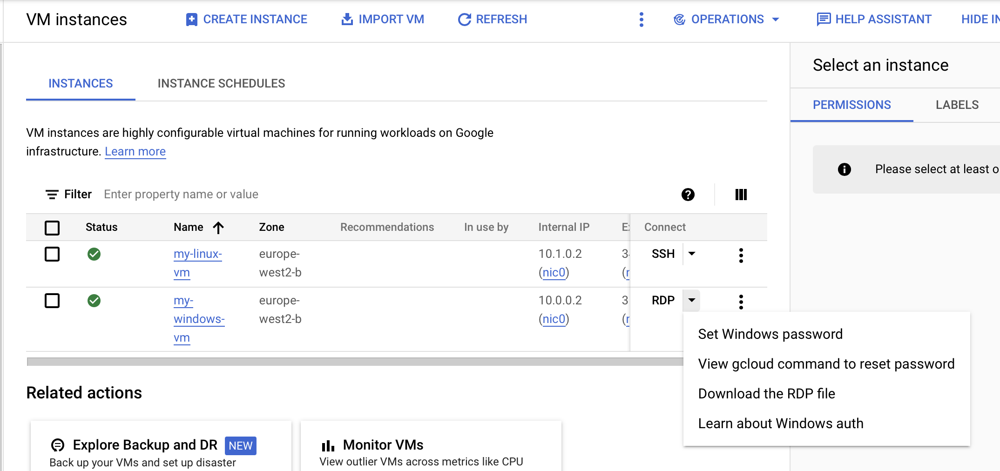
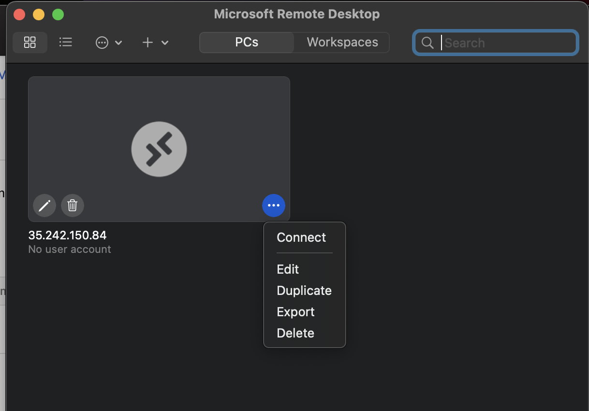

# Build Lab 3

## Overview
In this lab you will learn how to deploy a Windows 2019 web server in GCP. You will then learn how to connect to the instance with RDP.

## Getting started
To complete this lab you should have completed Build Lab 1 as we will deploy the Windows virtual machines into the networks you created.

## Creating a Windows Virtual Machine
1. If you haven't already - in your local repository create a file called `vms.tf`

2. To create the Windows [compute instance](https://registry.terraform.io/providers/hashicorp/google/latest/docs/resources/compute_instance) insert the following code block in vms.tf
   ```
    resource "google_compute_instance" "windows_vm" {
      name         = "my-windows-vm"
      machine_type = "e2-standard-2"
      zone         = "europe-west2-b"

      shielded_instance_config {
        enable_secure_boot = true
      }

      boot_disk {
        initialize_params {
          image = "windows-cloud/windows-2019"
        }
      }

      network_interface {
        network    = google_compute_network.vpc_network.name
        subnetwork = google_compute_subnetwork.windows_subnet.name
        access_config {
          // Ephemeral public IP
        }
      }
    }
   ```
   **Bonus**: If you completed the extension of Build lab 1 try adding you region variable to this with `"${var.region}-b"`

   Here we are creating an e2-standard-2 machine type is suitable for a Windows server.

   **Bonus:** There are many other images we could have selected! Try running the below command in your terminal to see what other images are available
   ```
   gcloud compute images list
   ```

3. In the build lab 1 we configured a [target tag](https://cloud.google.com/vpc/docs/add-remove-network-tags) for our firewall rule that will allow RDP traffic to any resource with the tag "allow-rdp". To configure the firewall rule to apply to our compute instance we need add this tag to it. Insert the following line of code into the compute instance resource block
   ```
   tags = ["allow-rdp"]
   ```

4. When we connect to the Windows VM via RDP we will need the external IP so that we can provide our local machine an address to connect to.
We can see the external IP by looking at our compute instance in the GCP console. But it is more convenient to output it into the terminal with a [terraform output](https://developer.hashicorp.com/terraform/language/values/outputs).

   Open the file `outputs.tf` and insert the following code block
   ```
    output "windows_external_ip" {
        value = google_compute_instance.windows_vm.network_interface.0.access_config.0.nat_ip
    }
   ```
   Now when we run `terraform apply` the external IP of our compute instance will be outputted in the terminal when the apply is complete.

5. To check that the compute instance is configured correctly run
   ```
   terraform plan
   ```
   When you are happy and wish to provision the instance run
   ```
   terraform apply
   ```

6. You can now see your instance in the GCP console


## Establishing an RDP connection to the Windows VM
1. Ensure you have installed Microsoft Remote Desktop app on your local device. If you don't, go to Self Service, search for Microsoft Remote Desktop, and install. Once installed, please continue with the lab.

2. Click "add PC". When the pop up appears copy in the external IP of your Windows instance into the field "PC name". Then click "add"

3. When we connect to the Windows server via RDP we will need to log in with Windows credentials.  We can generate these in the GCP console by clicking on the drop down next to the RDP button on our Windows instance
   
   and selecting "set Windows password". This will set up a password for your user (firstname_lastname).
   **Please note:** it can take up to 10 minutes for the Windows server to start up so you may get an error the first time you try to do this.

3. Once you have generated you password go back to the Microsoft Remote Desktop app and hover over the Windows instance you have added. This should bring up three dots in the right-hand corner click on that and in the drop down select "connect"
   

4. Enter the username and password you generated in step 3 when prompted. It will then log you into the Windows instance

5. Once the log in is complete you should be able to see the homescreen of your Windows server!
   **Please note:** it may take a few minutes for your instance to log in and set up Windows.

## Lab Extension
### Terraform local values
[Terraform local values](https://developer.hashicorp.com/terraform/language/values/locals) assign a name to an expression or value. They are temporary variables that can be used in your code to prevent duplication and help create more readable code as you can give expressions more meaningful names. Local values do not change between Terraform runs so they can be useful to fix a value to a name.
In the bonus of this lab we used `"${var.region}-b"` for the zone of our Windows compute instance. If we wanted to create more resources with a zone argument we could use a local value to make our code more readable.
Insert the following code in `vms.tf`
```
locals{
    default_zone = "${var.region}-b"
}
```
It is customary to declare your local value in the same file you are using it to improve readability. However you can put a locals block wherever it makes the most logical sense.  Local values can be accessed from anywhere in your terraform directory, meaning that if you declare a local in `vms.tf` of your project it is still accessible in `networks.tf`
You can reference your local variable like this
```
resource "google_compute_instance" "windows_vm" {
      name         = "my-windows-vm"
      machine_type = "e2-standard-2"
      zone         = local.default_zone
```
Locals can be used to combine multiple variables together which can be useful for creating strings from variables that may change.


## Finishing up
When you have completed the labs make sure to run
```
terraform destroy -auto-approve
```
This will clean up the infrastructure you have deployed.
