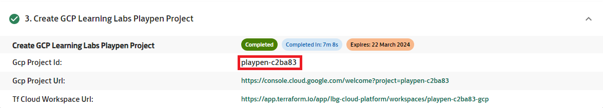

## Welcome to the Learning Labs for Terraform

This repository contains the Terraform build labs, and break fix labs for the Learning Labs. To view the labs please click into the corresponding folders. Each lab has its own README containing details on how to complete the tasks. The labs found here are designed to help develop a foundational knowledge of Terraform and to provide hands on experience with creating and running Terraform code to deploy infrastructure in GCP. Please note that the playpen and the linked repository will auto-delete after 12 hours of provisioning.

## Getting started
1. Firstly, you will need the value of your project id to run some of these steps. This can be found by going to the provisioning console, scrolling down to step 3, and looking for the `Gcp Project Id` value.



2. Ensure that you have the gcloud CLI installed from https://cloud.google.com/sdk/docs/install#mac

3. Clone this repository (your GitHub repository associated with your GCP Terraform archetype playpen environment) locally and open in VS Code. Run all following commands in the VS Code terminal.

   - In the terminal, run the below command and replace PROJECT_ID with your project id.

   ```

   git clone https://github.com/lbg-cloud-platform/PROJECT_ID-gcp.git

   ```
    - E.g., if your project id is `playpen-a1b2cd`, you will run `git clone https://github.com/lbg-cloud-platform/playpen-a1b2cd-gcp.git`

4. Login in to gcloud with
   ```
   gcloud auth login
   ```
5. Set your project for gcloud. To find your project ID, go to the provisioning console where you provisioned the Terraform Learning Lab environment. Click on the deployment details and scroll down to "Create GCP Playpen project". You should see a label named "Gcp Project Id" which is what you will replace PROJECT_ID with in this command.
   ```
   gcloud config set project PROJECT_ID
   ```
   This will set your playpen project as your default project for gcloud operations.


6. Authenticate with terraform cloud run. You will need to log in to Terraform cloud console before running this command (you may need to log out then back in too).
   ```
   terraform login
   ```
   Then when prompted type "yes"
   This should open a window for you to log into Terraform Cloud. Click "Sign in with SSO" near the bottom of the page. On the next page type in your Organization name "lbg-cloud-platform" and hit next. You will then be asked to sign into your dev account.

   When you reach your account you will be prompted to create an API token. Click create token and copy the token generated. Go back to your terminal and where it says enter value paste the API token you copied.


7. In `providers.tf`, replace `${workspace_name}` with your workspace name. This is your project id postfixed with `-gcp`. For example, `playpen-ab1c23-gcp`. This can be found as the name of your repository associated to the Terraform playpen environment.

8. Initialise your Terraform directory and download the Google provider run the following command. If it errors saying that the workspace doesn't exist, please log out of terraform and log back in. Then re run `terraform init`.
   ```
   terraform init
   ```
9. To access the project portal, go to the provisioning console where you provisioned the Terraform Learning Lab environment. Click on the deployment details and scroll down to "Create GCP Learning Labs Playpen project". You should see a label named "Gcp Project Url" with an associated project URL. Click this and it will take you to your project console.

10. You are now ready to begin the Terraform labs!

## GCP Labs
**Build Labs**
To find the Dev Mac build labs: build-labs > dev-mac-labs
* Build Lab 1 - VPCs and subnets
* Build Lab 2 - Linux compute instance and SSH
* Build Lab 3 - Windows compute instance and RDP

**Break Fix Labs**
* Break Fix Lab 1 - Syntax errors
* Break Fix Lab 2 - Networking errors
* Break Fix Lab 3 - Networking and syntax errors
